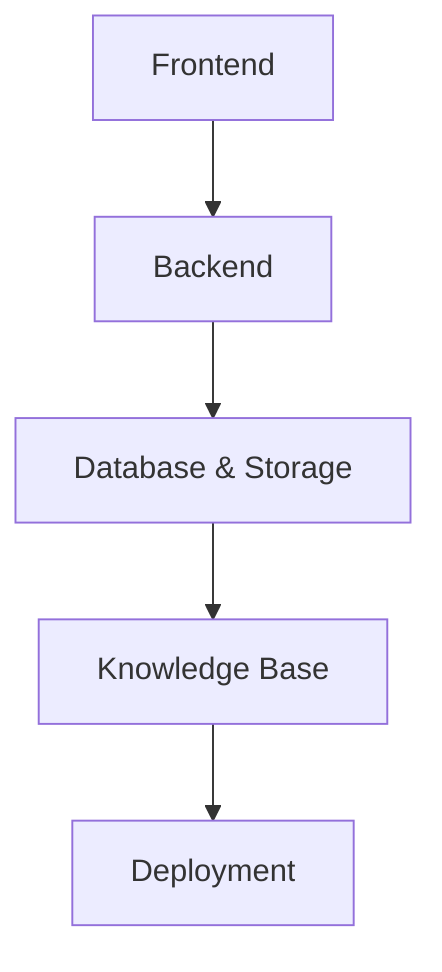

# Architecture Document for AI Tutor (CSE Curriculum)

## 1. Tech Stack (Open Source & Free-First Approach)

### Frontend
- **Framework**: React
- **UI Components**: TailwindCSS + ShadCN UI
- **Dynamic UI Generation**: OpenV0 (open source generative UI engine) / custom schema-driven UI builder
- **State Management**: Redux Toolkit or Zustand
- **Animations**: Framer Motion

### Backend
- **Framework**: FastAPI (Python)
- **Language Models (LLMs)**: 
  - Open source LLMs (LLaMA 2, Mistral, Falcon, etc.) running locally or via free-tier Hugging Face Inference
  - LangChain for orchestration
- **Agent Framework**: LangGraph (open source) or Haystack Agents
- **Mock/Test Engines**: Pytest (for test generation), Schemathesis (for API validation)

### Database & Storage
- **Primary DB**: PostgreSQL (structured content, user profiles, test results)
- **Vector DB**: Weaviate / Qdrant / ChromaDB (for semantic search on knowledge base and documents)
- **File Storage**: MinIO (self-hosted S3-compatible storage) for documents, resources, media

### Knowledge Base
- **Sources**: 
  - CSE textbooks (open educational resources)
  - Academic PDFs, Notes, Documentation
  - Pre-curated JSON schemas of topics
- **RAG Layer**: Haystack / LangChain document loaders + embedding pipeline

### Deployment
- **Containerization**: Docker + Docker Compose
- **Orchestration**: Local setup or free-tier Kubernetes (K3s / Minikube for dev)
- **Hosting**: Free-tier Render/Netlify for frontend, Railway/Fly.io for backend (open source friendly)

---

## 2. High-Level Architecture



```bash
User → Frontend (React + Gen UI) → Backend (FastAPI)
↕ ↕
Generative UI Engine (OpenV0/Schema UI) Agent Framework (LangChain/Haystack)
↕ ↕
Knowledge Base (Docs, PDFs, Notes) Vector DB (Weaviate/Qdrant/Chroma)
↕ ↕
Postgres (User data, results) File Store (MinIO for docs/resources)
```


---

## 3. Database Design (Detailed)

# 📂 Database Schema

## Users
| Field         | Type        | Description                                   |
|---------------|-------------|-----------------------------------------------|
| user_id (PK)  | UUID        | Unique user ID                                |
| name          | Text        | User’s name                                   |
| email         | Text        | User’s email (unique)                         |
| password      | Text        | User’s hashed password                        |
| role          | Enum        | `student`, `teacher`, `admin`                 |
| created_at    | Timestamp   | Account creation time                         |

---

## Knowledge Base
| Field           | Type        | Description                                   |
|-----------------|-------------|-----------------------------------------------|
| kb_id (PK)      | UUID        | Knowledge chunk ID                            |
| content         | Text        | Raw text or document content                  |
| embedding       | Vector      | Embedding vector for semantic search          |
| source          | Text        | Source (book, notes, external URL, etc.)      |
| tags            | Array<Text> | Metadata tags (e.g., “Python”, “OOP”)         |
| created_at      | Timestamp   | When added                                    |

---

## Courses
| Field          | Type        | Description                                   |
|----------------|-------------|-----------------------------------------------|
| course_id (PK) | UUID        | Unique course ID                              |
| title          | Text        | Course title (e.g., “Operating Systems”)      |
| description    | Text        | Course description                            |
| generated_by   | Enum        | `AI`, `admin` (indicates origin)              |
| created_at     | Timestamp   | When generated/added                          |

---

## Lessons
| Field           | Type        | Description                                   |
|-----------------|-------------|-----------------------------------------------|
| lesson_id (PK)  | UUID        | Unique lesson ID                              |
| course_id (FK)  | UUID        | Link to **Courses**                           |
| title           | Text        | Lesson title (e.g., “Memory Management”)      |
| content         | Text        | Lesson content (generated from KB)            |
| kb_refs         | Array<UUID> | References to **Knowledge Base** chunks       |
| generated_by    | Enum        | `AI`, `admin`                                 |
| created_at      | Timestamp   | When generated/added                          |

---

## Quizzes
| Field          | Type        | Description                                   |
|----------------|-------------|-----------------------------------------------|
| quiz_id (PK)   | UUID        | Unique quiz ID                                |
| lesson_id (FK) | UUID        | Linked to **Lessons**                         |
| title          | Text        | Quiz title (e.g., “Lesson 1 Quiz”)            |
| generated_by   | Enum        | `AI`, `admin`                                 |
| created_at     | Timestamp   | When generated/added                          |

---

## Questions
| Field           | Type        | Description                                   |
|-----------------|-------------|-----------------------------------------------|
| question_id (PK)| UUID        | Unique question ID                            |
| quiz_id (FK)    | UUID        | Linked to **Quizzes**                         |
| type            | Enum        | `mcq`, `short_answer`, `code`                 |
| question_text   | Text        | The actual question                           |
| options         | JSON        | MCQ options (if type = mcq)                   |
| correct_answer  | JSON        | Correct answer(s)                             |
| kb_refs         | Array<UUID> | References to **Knowledge Base** chunks       |
| created_at      | Timestamp   | When generated/added                          |

---

## User Progress
| Field            | Type        | Description                                   |
|------------------|-------------|-----------------------------------------------|
| progress_id (PK) | UUID        | Unique progress record                        |
| user_id (FK)     | UUID        | Linked to **Users**                           |
| lesson_id (FK)   | UUID        | Linked to **Lessons**                         |
| status           | Enum        | `not_started`, `in_progress`, `completed`     |
| score            | Int         | Latest score (if linked to quiz)              |
| updated_at       | Timestamp   | Last update                                   |

---

## Request Logs (optional, for Agentic Loop)
| Field          | Type        | Description                                   |
|----------------|-------------|-----------------------------------------------|
| log_id (PK)    | UUID        | Unique log ID                                 |
| user_id (FK)   | UUID        | Linked to **Users**                           |
| query          | Text        | User’s query                                  |
| action_taken   | Text        | Action by agent (retrieve KB, generate quiz…) |
| response       | JSON        | What was returned                             |
| timestamp      | Timestamp   | When interaction happened                     |

---

# 🔗 Relationships
- **Users → Progress → Lessons → Courses**  
- **Lessons → Quizzes → Questions**  
- **Lessons & Questions reference Knowledge Base chunks (kb_refs)**  
- **Logs track Agentic Loop interactions**

---

## 4. How Components Connect

- **Frontend (React)**:
  - Chatbot UI
  - Dynamic forms/tests generated from JSON schema
  - Resource viewers (PDF, code snippets)
  - Dashboard for progress

- **Backend (FastAPI)**:
  - Handles user auth & sessions
  - Parses API docs/resources
  - Exposes endpoints for Generative UI schema
  - Manages test generation & evaluation

- **Knowledge Base + Vector DB**:
  - Stores embeddings of CSE curriculum
  - Agent queries KB for relevant answers
  - Provides grounding for LLM responses

- **Agentic Loop**:
  - User asks a question
  - Backend parses → queries KB/vector DB
  - LLM generates explanation + schema for UI
  - Frontend dynamically renders UI
  - User interacts (tests/forms/resources)
  - Feedback saved in DB → loop continues

---

## 5. Summary

- **Frontend**: User-facing, interactive generative UI
- **Backend**: Orchestration, reasoning, schema generation
- **Knowledge Base + Vector DB**: Core intelligence source
- **Database**: Users, sessions, results, resources
- **Agentic Loop**: Continuous cycle of query → reasoning → UI → feedback → improvement
